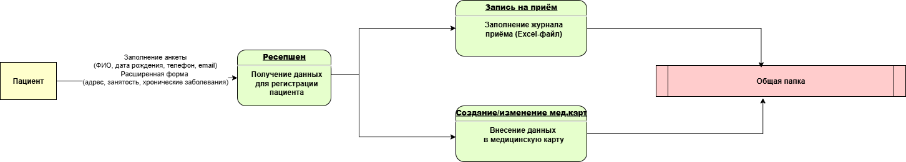
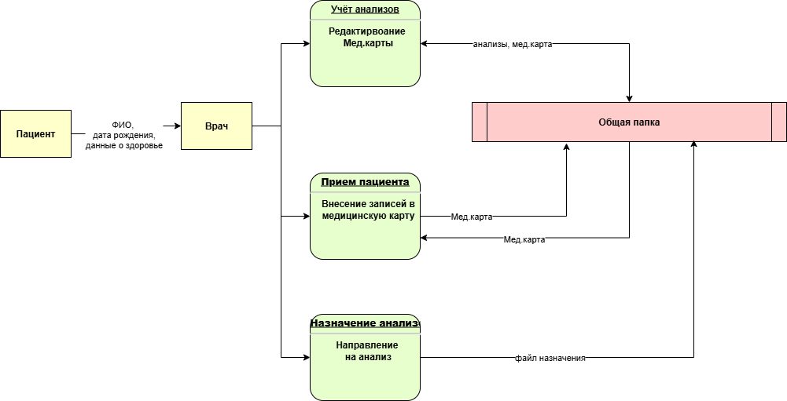
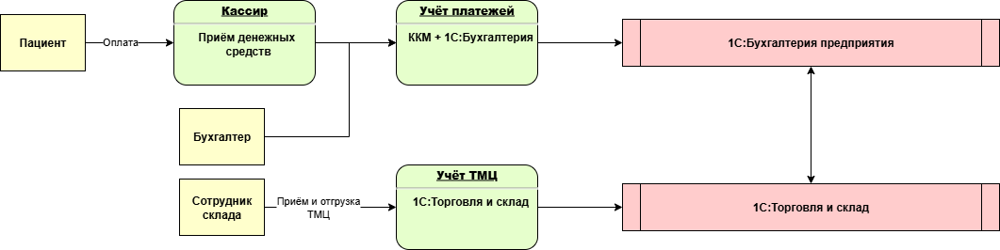

#Анализ безопасности системы
## Конфиденциальные данные 
В настоящий момент компания оперирует следующими данными, подпадающими под требования 152-ФЗ:
* ФИО
* дата рождения
* телефон
* электронная почта
* история болезни
* анализы

## DFD
В результате анализа были вделены следующие потоки данных
### Регистрация и запись пациента на приём

### Приём пациента у врача

### Оплата услуг и учёт ТМЦ

## Аудит мер по обеспечению безопасности (список проблемных зон)
* Журналы приёма пациентов, учёт пациентов и платежей, медицинские карты, учёт анализов ― хранятся в файлах Excel или в виде сканов. Материалы лежат на общем диске, следовательно каждый сотрудник имеет доступ ко всем данным в открытом виде (отсутствует контроль доступа), что не соответствует требогваниям 152-ФЗ.
* Данные обрабатываются сотрудниками вручную, что может привести к ошибкам и искажению данных.
* Отсутствует журналирование действий сотрудников над данными, никак не отслеживаются события модификаций данных.
* Срок хранения персональных данных не установлен (нет упоминания в тексте)
* Персональные данные собираются и хранятся избыточно (медицинские данные хранятся вместе с персональными данными)

## Рекомендации по улучшению
### Первоочеоредные меры
* Организовать ролевую модель внутри организации и разграничить доступ к ресурам на основе ролей (например, карты и результаты анализов видят только медицинские специалисты)
* Настроить механизмы доступа внутри сетевого контура организации с регулярной ротацией паролей и двухфакторной аутентификацией
* Обеспечить удаление устаревших данных или их архивацию с шифрованием
### Будущие меры (подход к Privacy By Design) - предполагает серьёзные изменения архитектуры системы 
* Провести инвентаризацию и классификацию данных: выделить общедоступные, внутренние и конфиденциальные данные
* Определить соответсвие получаемых от клиентов данных с подходом Data Minimization, прекратить сбор излишних данные 
* Внедрить механизмы аудита, логирования действий сотрудников с конфиденциальными и внутренними данными
* Обеспечить механизмы маскирования и обфускации данных на разных этапах Data Flow
* Настроить механизмы шифрования данных при хранении и передаче
* Внедрить систему централизованного хранения данных, соответсвующую всем указанным пунктам
