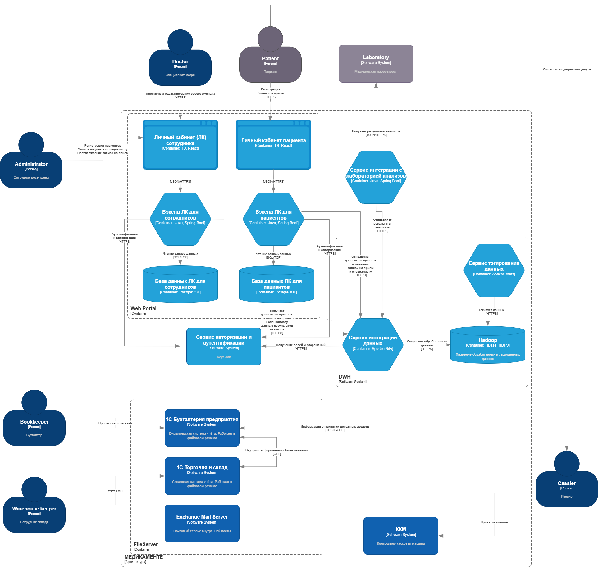

# Описание решения

Для обеспечения требований бизнеса и соответствия принциам Privacy By Design в рамках будущей системы предлагается реализовать следующие меры:

- Все запросы отправляются по HTTPS
- Пользователи и персонал авторизовываются через keycloak с соответствующими ролями
- API защищены на уровне сервиса, пользователь может увидеть только свою информацию
- Для тегирования данных используется защищённое хранилище Hadoop и специальный сервис тегирования данных 
- Данные шифруются на уровне бд и могут быть удалены по запросу пользователя
- При хранении используется шифрование AES-256, при передаче TLS 1.3
- Конфиденциальные данные автоматичестки уничтожаются по истечение срока хранения: персональные данные - через 5 лет после последнего взаимодействия взаимодействия с клиентом, медицинские данные через 10 лет после окончания лечения.

## Архитектура решения

